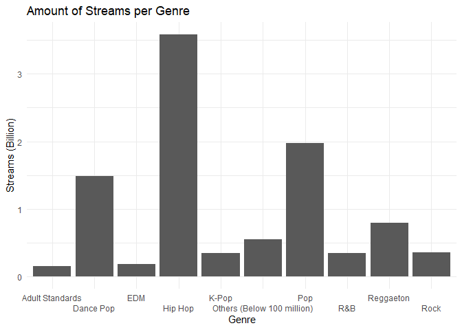

Interrogating G2 RQ4
================

> **What genre of music do listeners on Spotify enjoy listening to the
> most?**

As an musician or stakeholder involved in the music industry, it is
always essential to acknowledge that what the listeners or users would
like to enjoy, determining which genres are the most welcomed in general
is always helpful to specify what is the market looks like now and
predict what will become the customers’ next favorite hit in the future,
and this can be easily demonstrated with a bar chart:

``` r
library(tidyverse)
spotify <- read.csv("data/2/2.csv")
spotify %>% 
  mutate(Streams = as.numeric(gsub(",", "", Streams))) %>% 
  select(Genre, Streams) %>%
  plyr::ddply("Genre", plyr::numcolwise(sum)) -> genre_streams

attach(genre_streams)
gstreams_sorted <- genre_streams[order(-Streams),]
detach(genre_streams)

other_streams <- 0
for(row in 11:nrow(gstreams_sorted)){
  other_streams <- other_streams + gstreams_sorted[row, "Streams"]
}

head(gstreams_sorted, n = 10L) %>% 
  mutate_at(1, funs(ifelse(row_number() == n(),"Others (Below 100 million)",.))) %>%
  mutate_at(2, funs(ifelse(row_number() == n(), . + other_streams,.))) %>% 
  mutate(Streams = Streams / 1000000000) %>%
  ggplot() +
  aes(Genre, Streams) +
  geom_bar(stat = "identity") +
  scale_x_discrete(guide = guide_axis(n.dodge=2)) +
  xlab("Genre") + 
  ylab("Streams (Billion)") +
  ggtitle("Amount of Streams per Genre") + 
  theme_minimal() +
  geom_blank()
```

<!-- -->

It is quite obvious that Hip-Hop has successfully hit over 3.5 billion
streams from 2020 and being the \#1 favorite genres that people like,
with Pop music followed with nearly 2 billion plays, the Dance Pop is
located in third with 1.5 billion streams and that’s all the genres
breaking through 1 billion streaming. Reggaeton is quite welcomed and
hit over 500 million plays but Adult Standards, EDM, K-Pop, R&B and Rock
are just fluctuated below 500 million. Although the sum of all other
genres, while each of them has less than 100 million plays, has made it
over 500 million streams in total, but that’s 30 genres combined in
order to reach it. So it is quite easy to conclude that Hip-Hop is the
un-doubtful winner of hitting the most streams.
